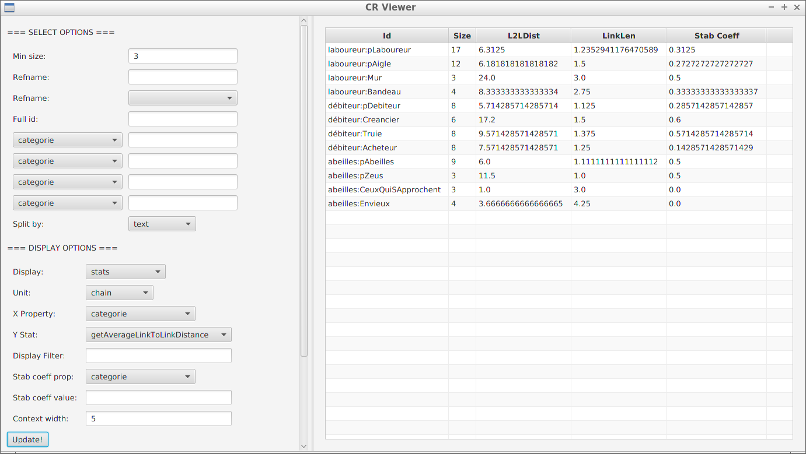
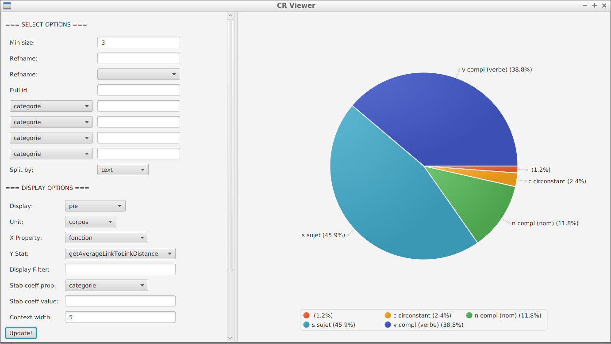
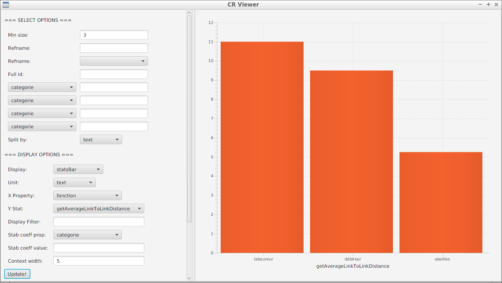

# crviewer -- CoReference Viewer

Computing co-reference chain statistics.


## Screenshots








## Running the program


Clone the repository or download it as zip.  If you download the zip, you must **decompress** it (do not just enter into it with your file manager: decompress it). Then run the `crviewer-<VERSION>.jar` file.

On Windows, you can double-click on the jar file icon, but this will start Java with the default Windows encoding (Windows-1252). If your text files are encoded using UTF-8, you will need to tell Java to use UTF-8. Start it with the command:

```bash
java -Dfile.encoding=UTF-8 -jar crviewer-<VERSION>.jar
```

or just double-click on the `start.bat` file.

On Linux, you may use the following command to start the program:

```bash
java -jar crviewer-<VERSION>.jar
```


## Tutorial

Tutorial videos are available on my [Youtube channel](https://www.youtube.com/@boberle), with a dedicated [playlist](https://www.youtube.com/watch?v=jpN2LMyQzEI&list=PLLXnGmOewaNUwVQm4UsVtzz4H2f-a7k6S):

- [présentation](https://www.youtube.com/watch?v=jpN2LMyQzEI&list=PLLXnGmOewaNUwVQm4UsVtzz4H2f-a7k6S),
- [récupérer et éditer les données](https://www.youtube.com/watch?v=d5aAJyS-Ivg&list=PLLXnGmOewaNUwVQm4UsVtzz4H2f-a7k6S&index=2),
- [filtrer par chaînes](https://www.youtube.com/watch?v=KvJR2OAoy2k&list=PLLXnGmOewaNUwVQm4UsVtzz4H2f-a7k6S&index=3),
- [filtrer par textes](https://www.youtube.com/watch?v=rDUEteFF4_o&list=PLLXnGmOewaNUwVQm4UsVtzz4H2f-a7k6S&index=4),
- [coefficient de stabilité](https://www.youtube.com/watch?v=t5sut9IFP-k&list=PLLXnGmOewaNUwVQm4UsVtzz4H2f-a7k6S&index=5),
- [récapitulatif](https://www.youtube.com/watch?v=g4mjJZafg5g&list=PLLXnGmOewaNUwVQm4UsVtzz4H2f-a7k6S&index=6),


## License

Released under the terms of the Mozilla Public License v2.0.  See the LICENSE file for details.  This program comes with ABSOLUTELY NO WARRANTY.


## Author

Want to talk? Reach me at bruno@boberle.com.

