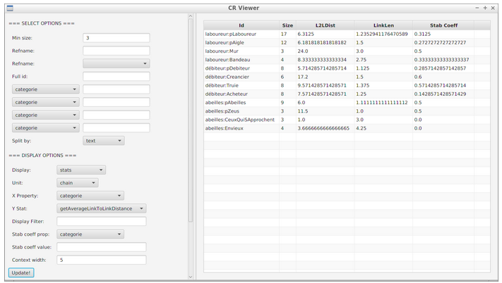
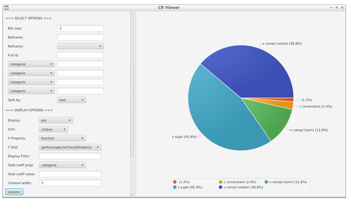
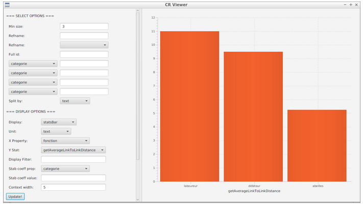

# CRViewer -- CoReference Viewer

Computing co-reference chain statistics

**Please note that the project has migrated on gitlab: [https://gitlab.com/boberle/crviewer](https://gitlab.com/boberle/crviewer)**

This is the version of the 2017 09 30.

You will find screenshots and video tutorials (in French) [here](http://boberle.com/projects/crviewer).

